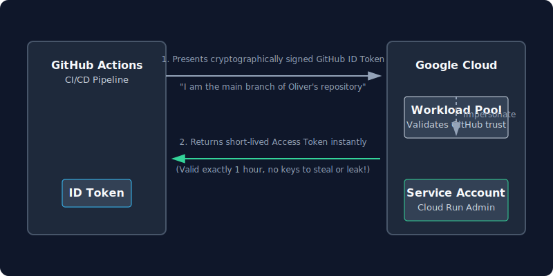

# 09 — Workload Identity Federation (Keyless GitHub Actions Auth)

← [Previous: 08 — Custom Domain & SSL](08_domain_ssl.md)

> ✅ **Free.** Workload Identity Federation has no cost.

## The problem with service account keys

The naive way to authenticate GitHub Actions to GCP is to create a JSON key file for the service account and paste it into a GitHub secret. This works but has risks: the key file never expires, if it leaks it gives full access until manually revoked, and rotating it requires manual steps.

## What is Workload Identity Federation?

Workload Identity Federation lets GitHub Actions prove its identity to GCP using a short-lived OIDC token (like a temporary ID card) instead of a permanent key. The flow is:



1. GitHub Actions requests a signed JWT from GitHub's OIDC provider, proving "I am a workflow running in repo `YOUR_ORG/YOUR_REPO` on branch `main`"
2. GCP's Workload Identity Pool verifies the JWT signature against GitHub's public keys
3. GCP issues a short-lived GCP access token (valid for ~1 hour)
4. The workflow uses that token to push images and deploy

No permanent credentials are ever stored anywhere.

---

## Setup (one-time, run in your local terminal)

```bash
# Fetches the numeric project ID — needed to construct the Workload Identity resource name.
PROJECT_NUMBER=$(gcloud projects describe mycoolproject-prod --format='value(projectNumber)')

# Creates a Workload Identity Pool — a container for external identity providers.
# Think of it as a trust boundary: only providers inside this pool can exchange tokens.
# Result: visible at console.cloud.google.com/iam-admin/workload-identity-pools
gcloud iam workload-identity-pools create github-pool \
  --location=global \
  --display-name="GitHub Actions Pool"

# Creates an OIDC provider inside the pool that trusts GitHub Actions' JWT tokens.
# attribute.repository maps the JWT's repo claim so we can restrict to specific repos.
# This tells GCP: "accept short-lived tokens signed by GitHub's OIDC issuer".
gcloud iam workload-identity-pools providers create-oidc github-provider \
  --location=global \
  --workload-identity-pool=github-pool \
  --display-name="GitHub provider" \
  --attribute-mapping="google.subject=assertion.sub,attribute.repository=assertion.repository" \
  --issuer-uri="https://token.actions.githubusercontent.com"
```

Attribute mapping explained:
- `google.subject=assertion.sub` — maps the JWT's `sub` field to GCP's subject
- `attribute.repository=assertion.repository` — exposes the repo name as a GCP attribute so we can restrict to specific repos

```bash
# Grants workflows from YOUR_ORG/YOUR_REPO permission to impersonate mycoolproject-run-sa.
# This is the key security boundary: only your repo can become that service account.
# Replace YOUR_ORG/YOUR_REPO with your actual GitHub org and repo name (e.g. acme/mycoolproject).
gcloud iam service-accounts add-iam-policy-binding \
  mycoolproject-run-sa@mycoolproject-prod.iam.gserviceaccount.com \
  --role="roles/iam.workloadIdentityUser" \
  --member="principalSet://iam.googleapis.com/projects/$PROJECT_NUMBER/locations/global/workloadIdentityPools/github-pool/attribute.repository/YOUR_ORG/YOUR_REPO"
```

This binding says: "workflows running from `YOUR_ORG/YOUR_REPO` may act as `mycoolproject-run-sa`". Workflows from any other repo cannot.

```bash
# Prints the full provider resource name — copy this value into the
# GCP_WORKLOAD_IDENTITY_PROVIDER GitHub secret in the next step.
gcloud iam workload-identity-pools providers describe github-provider \
  --location=global \
  --workload-identity-pool=github-pool \
  --format="value(name)"
```

The output looks like:
```
projects/123456789/locations/global/workloadIdentityPools/github-pool/providers/github-provider
```

---

## Add GitHub Secrets

Go to **GitHub → your repo → Settings → Secrets and variables → Actions → New repository secret**:

| Secret name | Value |
|---|---|
| `GCP_WORKLOAD_IDENTITY_PROVIDER` | The full provider resource name from the last command |
| `GCP_SERVICE_ACCOUNT` | `mycoolproject-run-sa@mycoolproject-prod.iam.gserviceaccount.com` |

These are the only two values GitHub needs. No JSON key file, no password.

---

## How the workflow uses them

In the GitHub Actions workflow (chapter 10), this step exchanges the GitHub OIDC token for a GCP access token:

```yaml
- uses: google-github-actions/auth@v2
  with:
    workload_identity_provider: ${{ secrets.GCP_WORKLOAD_IDENTITY_PROVIDER }}
    service_account: ${{ secrets.GCP_SERVICE_ACCOUNT }}
```

After this step, `gcloud` and `docker` commands in the workflow automatically use the GCP credentials. The token expires when the workflow ends.

---

## 📖 Navigation

- [01 — GCP Project Setup](01_gcp_setup.md)
- [02 — Artifact Registry](02_artifact_registry.md)
- [03 — Cloud SQL (PostgreSQL Database)](03_cloud_sql.md)
- [04 — Secret Manager](04_secret_manager.md)
- [05 — Cloud Storage (Media & Static Files)](05_cloud_storage.md)
- [06 — Dockerfile](06_dockerfile.md)
- [07 — First Deploy](07_first_deploy.md)
- [08 — Custom Domain & SSL](08_domain_ssl.md)
- **09 — Workload Identity Federation (Keyless GitHub Actions Auth)** (current chapter)
- [10 — GitHub Actions CI/CD Pipeline](10_github_actions.md)
- [11 — Quick Reference](11_quick_reference.md)
