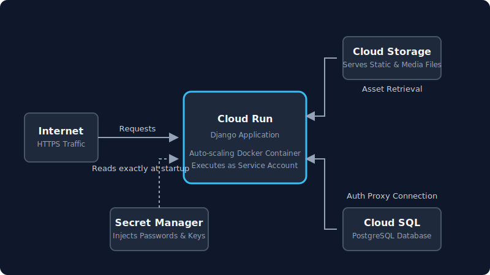
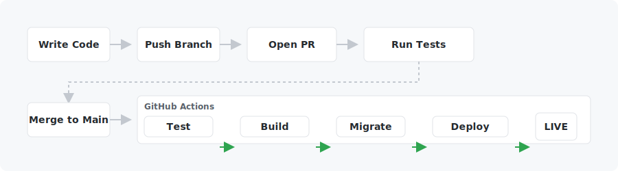

# Guía de Despliegue de Django en GCP

¡Bienvenido! Esta guía práctica te enseñará exactamente cómo tomar un proyecto local Django y desplegarlo de forma profesional en Google Cloud Platform usando patrones de infraestructura modernos y altamente escalables.

Al terminar estos capítulos, habrás construido un pipeline CI/CD completamente automatizado desde cero. Cada vez que subas código nuevo a GitHub, tu aplicación se compilará, se probará automáticamente y se publicará en internet al instante, sin ninguna intervención manual.

---

## Qué se despliega

Aunque usamos una aplicación web genérica de Django como ejemplo, **los conceptos de infraestructura que aprenderás aplican a casi cualquier framework web moderno**.

Tu aplicación final funcionará como un **contenedor Docker** protegido, alojado en **Cloud Run** — el potente motor serverless de Google. Esto significa que tu aplicación escalará sin esfuerzo ante picos de tráfico masivos y, cuando esté inactiva, bajará automáticamente a cero instancias para ahorrarte dinero.

## Arquitectura

**El flujo automatizado:** Una vez que la configuración inicial está lista, el despliegue se vuelve completamente automático. Cuando fusionas una nueva funcionalidad en la rama `main`, GitHub Actions se activa. Usando Workload Identity, inicia sesión en tu cuenta de Google Cloud de forma segura, sin depender de claves JSON de larga duración. Empaqueta tu nuevo código Django en una imagen Docker fresca, la archiva en Artifact Registry y le indica a Cloud Run que levante la nueva versión. En segundos, los usuarios activos pasan al contenedor recién desplegado, obteniendo archivos static desde Cloud Storage y consultando tu base de datos PostgreSQL en Cloud SQL.

## Servicios utilizados

| Servicio | Para qué sirve |
|---|---|
| **Cloud Run** | Ejecuta la aplicación Django como un contenedor. Escala a cero cuando está inactiva, escala bajo carga. Gestiona HTTPS automáticamente. |
| **Artifact Registry** | Almacena las imágenes Docker. Como Docker Hub pero privado y dentro de GCP. |
| **Cloud SQL** | Base de datos PostgreSQL gestionada. Google se encarga de los backups, parches y disponibilidad. |
| **Secret Manager** | Almacena credenciales (contraseña BD, secret key, API keys). Inyectadas en el contenedor en tiempo de ejecución — nunca en el código. |
| **Cloud Storage** | Almacenamiento de objetos para archivos subidos por usuarios y los archivos static de Django. |
| **GitHub Actions** | Ejecuta el pipeline CI/CD en cada push. Gratis para 2.000 minutos por mes. |
| **Workload Identity Federation** | Permite que GitHub Actions se autentique en GCP sin almacenar credenciales de larga duración en los secrets de GitHub. |

## Capítulos

Los capítulos están ordenados por **dependencia de configuración** — cada uno prepara la infraestructura que el siguiente necesita. Pero el flujo de desarrollo cotidiano es el inverso: subes código → GitHub Actions → construye la imagen → despliega en Cloud Run → lee de la infraestructura inferior.

### Orden de configuración (sigue este orden en el primer despliegue)

1. [Configuración del Proyecto GCP](01_gcp_setup.es.md) — proyecto, APIs, service account
2. [Artifact Registry](02_artifact_registry.es.md) — donde se almacenan las imágenes Docker
3. [Cloud SQL — Base de datos](03_cloud_sql.es.md) — PostgreSQL, migraciones
4. [Secret Manager](04_secret_manager.es.md) — credenciales, API keys
5. [Cloud Storage — Archivos media y static](05_cloud_storage.es.md) — subidas, CSS/JS
6. [Dockerfile](06_dockerfile.es.md) — empaquetar la app como contenedor
7. [Primer Despliegue](07_first_deploy.es.md) — despliegue manual para verificar que todo funciona
8. [Dominio Personalizado y SSL](08_domain_ssl.es.md) — mycoolproject.cl, HTTPS
9. [Workload Identity — Autenticación sin claves](09_workload_identity.es.md) — auth de GitHub a GCP sin claves
10. [GitHub Actions — Pipeline CI/CD](10_github_actions.es.md) — automatiza todo lo anterior en cada push
11. [Referencia Rápida](11_quick_reference.es.md) — todos los comandos en un solo lugar
12. [Bonus: Email Personalizado (@dominio.cl)](12_custom_email.es.md) — configuración de correo transaccional
13. [Bonus: Django Tasks](13_django_tasks.es.md) — procesamiento de tareas en segundo plano con django.tasks (incorporado en Django 6.0)
    - [13.A — Cloud Tasks via HTTP (recomendado)](13_django_tasks_cloud_tasks.es.md)
    - [13.B — db_worker embebido (alternativa)](13_django_tasks_embedded.es.md)

### Flujo de desarrollo cotidiano (una vez desplegado)

> **💡 Nota sobre los despliegues:** Abrir o actualizar un Pull Request **solo ejecuta tus pruebas** para asegurar que el código está en buen estado. Los pasos de despliegue (Build, Migrate, Deploy) solo se ejecutan cuando el código es oficialmente **fusionado/subido** a la rama `main`.

## Resumen de costos

> **Las cuentas nuevas de GCP reciben $300 en créditos gratuitos** — suficiente para ejecutar todo durante meses antes de pagar algo. **Los créditos vencen 90 días después de la creación de la cuenta**, independientemente del uso.

| Servicio | Nivel gratuito | Costo después del nivel gratuito |
|---|---|---|
| Cloud Run | 2M solicitudes + 360K CPU GB-s/mes | ~$0.00004/solicitud |
| Artifact Registry | 0.5 GB almacenamiento/mes | $0.10/GB/mes |
| Secret Manager | 6 versiones + 10K accesos/mes | $0.06/versión/mes |
| Cloud Storage | 5 GB/mes | ~$0.023/GB/mes |
| Cloud Storage egreso | — | ~$0.08–0.12/GB (servir archivos a usuarios) |
| GitHub Actions | 2.000 min/mes (repo privado) | $0.008/min |
| Workload Identity | Ilimitado | Gratis |
| Cloud Tasks | 1 M operaciones/mes | $0.40/M operaciones |
| **Cloud SQL** | ❌ **Sin nivel gratuito** | **~$7–10/mes siempre activo** |
| Dominio personalizado | — | ~$10–15/año en tu registrador |
| Certificado SSL | Gratis (gestionado por GCP) | — |

**Cloud SQL es el único servicio que comienza a cobrar inmediatamente y de forma continua.** Configúralo de último — justo antes de salir a producción — para minimizar el gasto en inactividad.

### Orden recomendado de configuración para minimizar costos

Primero estos — todos gratuitos:

- Capítulos 01, 02, 04, 09, 10 (proyecto GCP, Artifact Registry, Secret Manager, Workload Identity, GitHub Actions)

Luego casi gratuitos:

- Capítulos 05, 06, 07 (Cloud Storage, Dockerfile, despliegue en Cloud Run)

Luego cuando estés listo para salir a producción (comienzan los costos):

- Capítulo 03 — Cloud SQL (~$7–10/mes desde el momento en que se crea)
- Capítulo 08 — Dominio personalizado (~$10–15/año, pagado a tu registrador)

---

## Prerrequisitos

- [gcloud CLI](https://cloud.google.com/sdk/docs/install) instalado y autenticado (`gcloud auth login`)
- Docker instalado localmente (para el primer despliegue manual)
- Una cuenta de GCP (las cuentas nuevas reciben $300 en créditos gratuitos)
- Un repositorio de GitHub con el código fuente del proyecto

---

## 📖 Capítulos

- [01 — Configuración del Proyecto GCP](01_gcp_setup.es.md)
- [02 — Artifact Registry](02_artifact_registry.es.md)
- [03 — Cloud SQL (Base de Datos PostgreSQL)](03_cloud_sql.es.md)
- [04 — Secret Manager](04_secret_manager.es.md)
- [05 — Cloud Storage (Archivos media y static)](05_cloud_storage.es.md)
- [06 — Dockerfile](06_dockerfile.es.md)
- [07 — Primer Despliegue](07_first_deploy.es.md)
- [08 — Dominio Personalizado y SSL](08_domain_ssl.es.md)
- [09 — Workload Identity Federation (Autenticación sin claves en GitHub Actions)](09_workload_identity.es.md)
- [10 — Pipeline CI/CD con GitHub Actions](10_github_actions.es.md)
- [11 — Referencia Rápida](11_quick_reference.es.md)
- [12 — Bonus: Email Personalizado (@dominio.cl)](12_custom_email.es.md)
- [13 — Bonus: Django Tasks](13_django_tasks.es.md) — procesamiento de tareas en segundo plano con django.tasks
