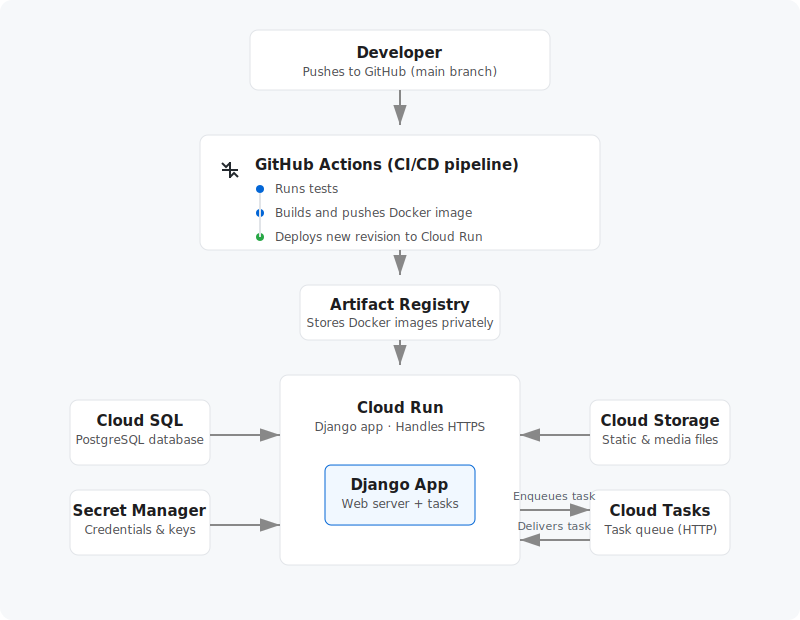

# Django Deployment Guide using GCP

Welcome! This practically-focused guide will teach you exactly how to take a local Django project and professionally deploy it to Google Cloud Platform using modern, highly-scalable infrastructure patterns.

By the end of these chapters, you will have built a completely automated CI/CD pipeline from scratch. Every time you push new code to GitHub, your app will securely build, test itself, and instantly deploy live to the internet with zero manual intervention.

---

## What gets deployed

While we use a generic Django web application as our blueprint, **the core infrastructure concepts you'll learn here apply to almost any modern web framework**. 

Your final application will run as a protected **Docker container** hosted on **Cloud Run** — Google's powerful serverless engine. This means your app will effortlessly scale up to handle massive traffic spikes seamlessly, and crucially, it will automatically scale all the way down to zero when idle to save you money.

## Architecture

**The Automated Workflow:** Once your initial setup is complete, deployment becomes entirely hands-off. When you push or merge a new feature into the `main` branch, GitHub Actions automatically wakes up. Using securely authenticated Workload Identity, it logs into your Google Cloud account without relying on risky, long-lived JSON keys. It cleanly packages your newest Django code into a fresh Docker image, archives it safely inside Artifact Registry, and instructs Cloud Run to spool up the new version. Within seconds, your active users transition to the newly deployed container, fetching static assets from Cloud Storage and directly querying your PostgreSQL database on Cloud SQL.

## Services used

| Service | What it does |
|---|---|
| **Cloud Run** | Runs the Django app as a container. Scales to zero when idle, scales up under load. Handles HTTPS automatically. |
| **Artifact Registry** | Stores Docker images. Like Docker Hub but private and inside GCP. |
| **Cloud SQL** | Managed PostgreSQL database. Google handles backups, patches, and availability. |
| **Secret Manager** | Stores credentials (DB password, secret key, API keys). Injected into the container at runtime — never stored in code or environment files. |
| **Cloud Storage (GCS)** | Object storage for user-uploaded images and Django's collected static files. |
| **GitHub Actions** | Runs the CI/CD pipeline on every push. Free for 2,000 minutes/month. |
| **Workload Identity Federation** | Lets GitHub Actions authenticate to GCP without storing long-lived credentials in GitHub secrets. |

## Chapters

The guide is ordered by **setup dependency** — each chapter sets up infrastructure the next one needs. But the everyday development flow is the reverse: you push code → GitHub Actions → builds image → deploys to Cloud Run → reads from the infrastructure below.

### Setup order (follow this when deploying for the first time)

1. [GCP Project Setup](01_gcp_setup.md) — project, APIs, service account
2. [Artifact Registry](02_artifact_registry.md) — where Docker images are stored
3. [Cloud SQL — Database](03_cloud_sql.md) — PostgreSQL, migrations
4. [Secret Manager](04_secret_manager.md) — credentials, API keys
5. [Cloud Storage — Media & Static Files](05_cloud_storage.md) — uploads, CSS/JS
6. [Dockerfile](06_dockerfile.md) — packaging the app as a container
7. [First Deploy](07_first_deploy.md) — manual deploy to verify everything works
8. [Custom Domain & SSL](08_domain_ssl.md) — mycoolproject.cl, HTTPS
9. [Workload Identity — Keyless Auth](09_workload_identity.md) — GitHub → GCP auth without keys
10. [GitHub Actions — CI/CD Pipeline](10_github_actions.md) — automates all of the above on every push
11. [Quick Reference](11_quick_reference.md) — all commands in one place
12. [Bonus: Custom Email (@domain.cl)](12_custom_email.md) — transactional email configuration
13. [Bonus: Django Tasks](13_django_tasks.md) — background job processing with django.tasks (Django 6.0 built-in)
    - [13.A — Cloud Tasks via HTTP (recommended)](13_django_tasks_cloud_tasks.md)
    - [13.B — Embedded db_worker (alternative)](13_django_tasks_embedded.md)

### Everyday development flow (once deployed)

> **💡 Note on Deployments:** Opening or updating a Pull Request will **only run your tests** to ensure the code is healthy. The actual deployment steps (Build, Migrate, Deploy) only execute when code is officially **merged/pushed** to the `main` branch.

## Cost overview

> **New GCP accounts get $300 free credits** — enough to run everything for months before paying anything. **Credits expire 90 days after account creation**, regardless of usage.

| Service | Free tier | Cost after free tier |
|---|---|---|
| Cloud Run | 2M requests + 360K CPU GB-s/month | ~$0.00004/request |
| Artifact Registry | 0.5 GB storage/month | $0.10/GB/month |
| Secret Manager | 6 secret versions + 10K accesses/month | $0.06/version/month |
| Cloud Storage | 5 GB/month | ~$0.023/GB/month |
| Cloud Storage egress | — | ~$0.08–0.12/GB (serving files to users) |
| GitHub Actions | 2,000 min/month (private repo) | $0.008/min |
| Workload Identity | Unlimited | Free |
| Cloud Tasks | 1 M operations/month | $0.40/M operations |
| **Cloud SQL** | ❌ **No free tier** | **~$7–10/month always running** |
| Custom domain | — | ~$10–15/year at your registrar |
| SSL certificate | Free (managed by GCP) | — |

**Cloud SQL is the only service that starts billing immediately and continuously.** Set it up last — right before go-live — to minimise idle spend.

### Recommended setup order to minimise cost

Do these first — all free:

- Chapters 01, 02, 04, 09, 10 (GCP project, Artifact Registry, Secret Manager, Workload Identity, GitHub Actions)

Then nearly free:

- Chapters 05, 06, 07 (Cloud Storage, Dockerfile, Cloud Run deploy)

Then when ready to go live (starts costing money):

- Chapter 03 — Cloud SQL (~$7–10/month from the moment it's created)
- Chapter 08 — Custom domain (~$10–15/year, paid to your registrar)

---

## Prerequisites

- [gcloud CLI](https://cloud.google.com/sdk/docs/install) installed and authenticated (`gcloud auth login`)
- Docker installed locally (for the first manual deploy)
- A GCP account (new accounts get $300 free credits)
- A GitHub repository with the MyCoolProject codebase

---

## 📖 Chapters

- [01 — GCP Project Setup](01_gcp_setup.md)
- [02 — Artifact Registry](02_artifact_registry.md)
- [03 — Cloud SQL (PostgreSQL Database)](03_cloud_sql.md)
- [04 — Secret Manager](04_secret_manager.md)
- [05 — Cloud Storage (Media & Static Files)](05_cloud_storage.md)
- [06 — Dockerfile](06_dockerfile.md)
- [07 — First Deploy](07_first_deploy.md)
- [08 — Custom Domain & SSL](08_domain_ssl.md)
- [09 — Workload Identity Federation (Keyless GitHub Actions Auth)](09_workload_identity.md)
- [10 — GitHub Actions CI/CD Pipeline](10_github_actions.md)
- [11 — Quick Reference](11_quick_reference.md)
- [12 — Bonus: Custom Email (@domain.cl)](12_custom_email.md)
- 13 — Bonus: Django Tasks *(overview)*
  - [13.A — Cloud Tasks via HTTP](13_django_tasks_cloud_tasks.md)
  - [13.B — Embedded db_worker](13_django_tasks_embedded.md)
